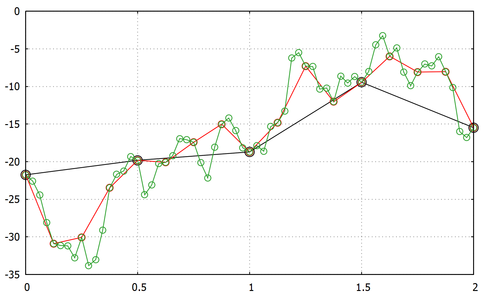

# Brownian bridge

Brownian motion W(t) is a continuous time stochastic process with independent
increments that are normally distributed as: W(t_j) - W(t_i) ~ N(0, t_j - t_i).
Since a continuous process requires infinite precision we are forced to
approximate it over sufficiently small values of: dt = t_j - t_i. A Brownian
bridge allows us to upscale the resolution over smaller dt which gives us a
finer approximation of the actual continuous process.
